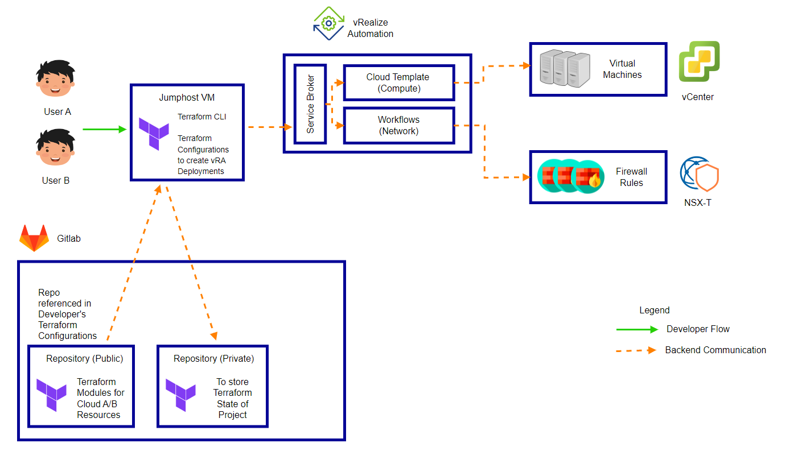

# **Innohack Project 2022 - Enabling IaC in Cloud A/B**

## **1. Objectives and Design Considerations**
---
### **1.1. Background**
Currently, developers are only able to provision their resources through our Cloud A/B landing page (GUI). 

When developers request for resources (e.g. VMs, Firewalls) from the Service Catalog in VRA, they are created in the form of Deployments.
> A Deployment is a container that holds your provisioned resources in vRA. 

From the Deployments page, they can manage their deployed resources by performing Day 2 actions (e.g. Add Disk to VM, shutdown, startup etc.).
 
However, there is currently **no automated way to provision cloud resources in Cloud A/B**. As such, the current process flow for developers to request for their cloud resources are as follows:

    **A. Provisioning a VM**
      1. Developers select what to provision via Cloud A/B's Landing Page, or vRA service broker
      2. They fill in the relevant details in the Catalog Item form (e.g. Server Hostname, VM Size, VM Count)
      3. Submit the Catalog Item Request 

    **B. Create a Security Group**
      4. Repeat Step A1-A2
      5. Submit the Catalog Item Request 

    **C. Add VMs to newly-created Security Group**
      6. Repeat Step A1-A2
      7. Submit the Catalog Item Request
      8. Wait for Project Approver to approve the request

    **D. Create a Firewall Rule to allow incoming traffic to my Security Group**
      9. Repeat Step A1-A2
      10. Submit the Catalog Item Request
      11. Wait for Project Approver to approve the request 

    **E. (Optional) Modify a Firewall Rule**
      12. Repeat Step A1-A2
      13. Submit the Catalog Item Request
      14. Wait for Project Approver to approve the request 
    
A lot of time is taken for a developer to navigate through the GUI to create their required cloud resources. 

Moreover, some of these catalog items are also on a fire-and-forget basis (e.g. Firewall-as-a-Service). This means even if the vRA deployment is deleted, the Firewall Rule will still persist in NSX-T. This also implies that developers have to go through 3 different Catalog Items in vRA (3 different deployments created) just to create/modify/delete a firewall rule. 

> In summary, there are 2 potential areas of improvement with our current Cloud Resource provisioning process:
>   1. A lot of time taken to navigate through GUI to create resources
>   2. Resources are not fully mapped to vRA deployments (specifically Firewall-as-a-Service)
> 
> **Ultimately, there is a need to provide developers with a more streamlined developer experience in Cloud A/B.**

### **1.2. Objectives**

We aim to enable developers to utilize Infrastructure-as-Code (IaC) to provision our Cloud A/B Resources. With IaC, developers can simply declare what resources they want to create via a IaC Tool (specifically Terraform), and it will trigger the relevant API calls to our Backend infrastructure to create the necessary cloud resources. 

Through IaC, the process flow for developers to provision cloud resources can be **significantly shortened**:

    **A. Provisioning a VM + Creating a Firewall Rule**
      1. Developers create their Terraform Configuration with the respective resources
         - 1x VM
         - 1x Firewall Rule
           - Source: External IP Address
           - Dest: 1x VM
      2. Terraform Apply
      3. Wait for resources to be created

    **B. (Optional) Modify the Firewall Destination to include a new VM**
      4. Developers modify their Terraform Configuration with the respective resources
         - 2x VM
         - 1x Firewall Rule
           - Source: External IP Address
           - Dest: 2x VM
      5. Terraform Apply
      6. Wait for resources to be created

**Some of the benefits from using IaC include:**
1. Reduce the time required to provision cloud resources in Cloud A/B
2. Lower Risk of Human Error
3. Version Control of IaC 

### **1.3. Design Considerations**
1. Developers will still follow the VRA Project Construct
     - Can only request for resources within their project resource limits
     - Follows the Role-based Access Control (RBAC) in VRA --> unable to bypass any approval policies 
2. Attempt to use tools and processes that developers are familiar with --> Reduce the amount of Cognitive Load for Developers 
3. Provisioned resources from Terraform will still be able to integrate with our existing cloud services
4. Developers should be able to manage their IaC using source control tools e.g. Gitlab 

### **1.4. Project Scope**
1. To propose an operational design to enable IaC for Cloud A/B Resources
2. To refactor our VRA Resources to be idempotent --> allowing these services to be IaC-Compatible
3. To enable CI/CD of IaC templates 
4. To perform a walkthrough of declaring Cloud A/B resources from a developers' perspective

Our scope of work will be performed in Cloud B first. 

## **2. Terraform Design**
---
### **2.1. Option 1: Configuring Terraform Integration in VRA**

    VRA + Terraform --> Cloud A/B Resources

Option #1 involves configuring Terraform Integration with VRA, allowing Cloud Admins and developers to declare custom Terraform configurations in Cloud Templates. Since Cloud Templates are declarative by default (e.g. Resources will be deleted when the deployment is deleted), we can leverage option #1 to declare resources that are not idempotent in Cloud A/B (e.g. Firewall Rules)

The general developer process flow will be very similar to what is present in Cloud A/B. The Terraform configurations are abstracted from the developers (only declared in Cloud Templates).

#### **Pros**
- Using NSX-T Terraform Provider, we can declare the following in our Cloud Templates (Hybrid TF-VRA Blueprints): 
  - NSX-T Policies (DFW + GFW)
  - NSX-T Security Groups

#### **Cons**
- Requires an External Kubernetes Cluster to be integrated with VRA to host Terraform Runtime (likely managed by us)
- Developers still have to manage their deployments through VRA Service Catalog, doesn't provide an option to use CI/CD for their resources

#### **References**
- https://blogs.vmware.com/management/2020/09/terraform-service-in-vra.html
- https://docs.vmware.com/en/vRealize-Automation/8.8/Using-and-Managing-Cloud-Assembly/GUID-FBA52A2A-F34F-4D1B-8247-DA1364C8DB16.html
- https://registry.terraform.io/providers/hashicorp/vsphere/latest/docs
- https://registry.terraform.io/providers/vmware/nsxt/latest/docs

### **2.2. Option 2: Using External Terraform to interface with VRA**

    Terraform [External] --> Cloud A/B Resources

Option #2 involves using an external Terraform Runtime to interface with VRA to create resources. 

We will create a public repository (E.g. Terraform) within our self-hosted Gitlab to store the following:
    - Terraform CLI 
    - Terraform Providers (VMWare vRealize Automation Provider)
    - Sample Terraform Configuration Templates
    - Shellscript to initialize Terraform Working Directory + extract developers' VRA Refresh Token

Developers are free to fork the repository and configure their own custom Terraform Configuration templates to state how much resources they need. 

A separate Content Source (for Cloud Templates and VRO Workflows) will be tailor-made just for Terraform compatibility.
> Note: To simpliy the declaration of infrastructure, 1 Deployment will be tied to 1 resource (VM, SG, FW Rule). These deployments will then be managed via developers' Terraform Configurations. 

The general developer process flow will be as follows: 
1. Developers spinning up a Jumphost Server (JH) in Cloud A/B
2. Git clone the Terraform Repository into JH and/or pull their custom Terraform configurations from their own repositories
3. Initialize Terraform Working Directory & get developer's VRA refresh token --> update it in their Terraform Variables file
4. Terraform init --> Terraform plan --> Terraform Apply

#### **Pros**
- Terraform binaries and configuration templates are stored in Gitlab, allowing version control of Cloud A/B infrastructure
- Developers are able to integrate Cloud A/B infrastructure codes into their CI/CD pipeline, streamlining their application development process 
- Integrates pretty well with our existing Cloud Services (workflows triggered after deployment creation)

#### **Cons**
- Some of our catalog items are not IaC Compatible (e.g. Firewall as a Service). Will need to refactor the catalog items to achieve idempotency 
- only vra_deployment resource in VRA Terraform Provider is relevant, and is very limited in functionality (Day 2 custom actions like update deployment / add disk cannot be done through Terraform) 
- [Need to review] Day 2 Action policies to be set for Terraform Content Source to ensure resources are immutable 
- Developers still need to spin up a jumphost server manaually to initialize their Terraform runtime (it's current practices now)

#### **References**
- https://registry.terraform.io/providers/vmware/vra/latest/docs
- https://blogs.vmware.com/management/2020/01/getting-started-with-vra-terraform-provider.html

### **2.3. Option 3: Hybrid Approach**

    Terraform [External] --> VRA + Terraform --> Cloud A/B Resources

Option #3 is a hybrid approach of Option #1 and #2. It combines the pros and cons of both options, but essentially this provides the most comprehensive approach to enable CI/CD of Infrastructure Code for Cloud A/B Resources, given our timeline. 
- NSX-T related Cloud Templates backed by Terraform Configurations
- VM related Cloud Templates declared via external Terraform runtime

## **3. VRA Design**
---
A declarative approach to provision infrastructure is where the user defines the desired state of the system, including what resources you need and any properties they should have, and an IaC tool will configure it for you. A declarative approach also keeps a list of the current state of your system objects, which makes taking down the infrastructure simpler to manage.

### **3.1. Clear Desired State**
A basic requirement to enable IaC is that **the resources created must be tied to the VRA Deployments' lifecycle**. If a deployment is deleted from VRA, the resources tied to the deployment will be deleted as well. 

In the context of Cloud A/B, we can enforce the following to ensure a clear Desired State:

    1. VRA Cloud Templates are declarative by design. By deleting Cloud Template deployments, the resources will be removed as well. 
    2. For VRO Workflow Catalog Items, ensure that a subscription (to delete resource) is tagged to the Catalog Item when said deployment is deleted. 

Currently, some of our catalog items do not follow this rule (e.g. Firewall-as-a-Service). These workflows need to be re-factored to fit this design consideration. 

### **3.2. Immutability**
An immutable infrastructure implies that the **infrastructure cannot be modified once deployed**. When changes are necessary, you need to deploy afresh, swing traffic to the new instance and decommission old infrastructure. 

> One key requirement to enable immutable infrastructure for Cloud A/B Resources is that **application data must be externalized from the managed infrastructure**. This ensures that when new resources are created using Terraform (e.g. Web Servers) and any additional configuration management tools (e.g. Ansible), it will not require an in-place upgrade/modification, or any data migration. The new resources can simply point to the external database, and redirect application traffic from the old instance to the new one. 

In the context of Cloud A/B, it is difficult to ensure immutability of cloud resources, since vRA promotes the use of Day 2 actions to manage provisioned resources. 

However, we can enforce the following to ensure immutability of vRA Deployments:

    1. Restrict any Day 2 actions on the VRA Deployments --> The only Day 2 action allowed for developers is to delete their own deployments through Terraform. 

We also recognize that not all developers are comfortable with creating immutable infrastructure, as they are used to perform in-place upgrades of their application on their existing infrastructure. That's why we are offering an alternative approach to declaring resources in Cloud A/B. Developers can choose to create mutable infrastructure (through GUI) or create immutable infrastructure (through Terraform) that can be version-controlled by Gitlab.

### **3.3. Idempotency**
Idempotence is a principle of IaC where **certain operations can be applied multiple times without changing the results**. 

Terraform's configuration language is declarative by design, where developers can apply their configurations as many times as they want, but it will not change the end-state of the infrastructure. 

#### **References**
- https://www.redhat.com/en/topics/automation/what-is-infrastructure-as-code-iac
- https://learn.microsoft.com/en-us/devops/deliver/what-is-infrastructure-as-code
- https://www.hashicorp.com/resources/what-is-mutable-vs-immutable-infrastructure
- https://www.hashicorp.com/tao-of-hashicorp
- https://blogs.vmware.com/management/2020/01/infrastructure-as-code-and-vrealize-automation.html

## 4. Enabling CI/CD of Infrastructure-related Artifacts
---

### **4.1. GitLab Design**

## 5. User Requirements
---

### **5.1. Happy Flow**

The developers should be able to declare the following infrastructure resources via Terraform:
1. Virtual Machines 
2. Firewall Rules
3. Object Storage

### **5.2. Developer Process Flow**

The proposed developer process flow will be as follows: 

1. Developers will provision a Jumphost VM in Cloud A/B

2. Run terraform-setup.sh to perform the following: 
- Pull Terraform CLI and vRA Provider from Gitlab Project
- Install Terraform CLI in Jumphost VM
- Configure vRA Provider within Jumphost VM 

3. Developers will create their own Terraform Configuration file to declare what resources they want to provision from vRA
> Terraform Configuration main.tf & variables.tf templates are provided in Terraform project.  

4. Developers will initialize their Terraform Configuration using the following commands: 
- terraform init
- terraform plan 

> OPTIONAL: When running terraform plan, they can choose to store their terraform state files onto their own Gitlab projects, to be accessible by all project team members

5. Developers apply their terraform configurations through their Jumphost VM, which will initiate Terraform to perform API calls to vRA and create their intended infrastructure. 

6. Another developer from the same project can pull the Terraform State that is stored on the Project's Gitlab repository, to ensure a centralized infrastructure state is maintained within the project. 
   

## 6. Milestones
---

### Main Deliverables
- [BARE MINIMUM] Complete Option #2 by March 2023
- [MEETING EXPECTATIONS] Complete Option #3 by March 2023
- [EXCEEDING EXPECTATIONS] Complete Option #4 by March 2023

### **Stretch Goals**

Explore the Provisioning of Resources through Push Requests of Terraform Configurations in Gitlab 

    Gitlab --> VRA --> Cloud A/B Resources

This option involves developers interfacing with Gitlab to manage their Terraform configurations. Once developers push their configurations onto Gitlab, it triggers a CI/CD pipeline to create a Gitlab Runner (with Terraform Runtime) that provisions the necessary resources. Gitlab will store the Terraform state for Cloud A/B Resources. 

#### **Pros** 
- Developers do not need to create a jumphost server in SDC manually. Terraform State management is outsourced to Gitlab. 
- CI/CD pipeline for Terraform can be integrated with developers' existing application CI/CD pipeines 

#### **Cons**
- Further exploration is required for this approach. Possibly can push it to Phase 2 of project.

#### **References**
- https://docs.gitlab.com/ee/user/project/integrations/webhooks.html
- https://docs.gitlab.com/ee/user/infrastructure/iac/

